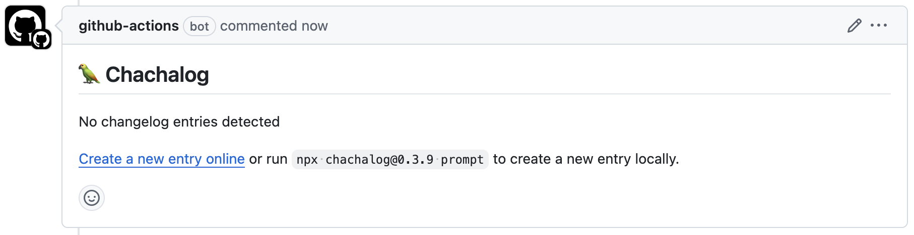
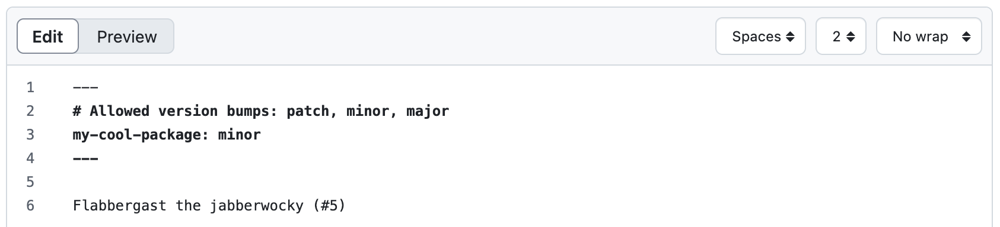
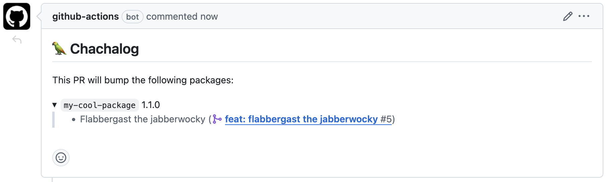
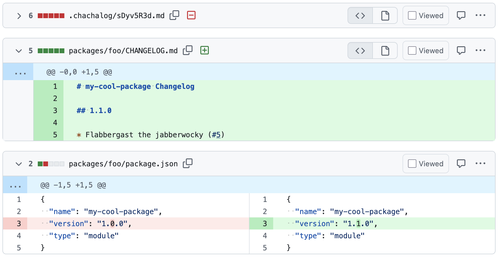
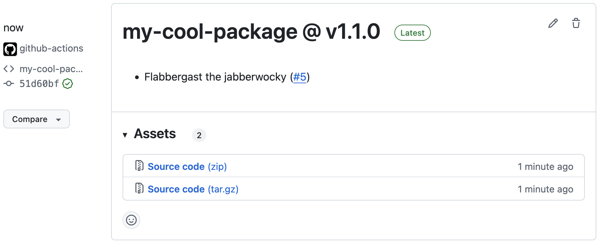

# 🦜 Chachalog

_The modern changelog generator._

Chachalog is a tool meant to ease the process of **writing changelogs** and **creating releases**. Plug the package manager of your choice (npm, Yarn, pnpm) and inherit its features like **monorepo support**, or don't use a package manager at all.

Extensible by design, Chachalog lets you add your own plugins to support other package managers or languages.

## Workflow

Here's what to expect when enabling all the features:

1. Create a new branch for your changes, and open a pull request to the main branch.

<p align="center"></p>

2. **Chachalog will comment your pull request to invite you to write a changelog entry.**

   

   A changelog entry is a markdown file that describes the changes you made, and the desired version bump associated with that change.

   For instance, following [Semantic Versioning](https://semver.org/), a bug fix would be a _patch_ bump, a new feature would be a _minor_ bump, and a breaking change would be a _major_ bump.

   You can add a new entry by clicking the link in the comment, or by running `npx chachalog prompt` in your terminal.

   

   In a monorepo setup, the same entry can be used to bump several packages at once: you need to specify all the packages affected by your changes in the frontmatter.

<p align="center"></p>

3. Your pull request is ready to be reviewed and merged.

   The changelog entry is committed along with your code changes to the pull request, under a random name. This is perfectly fine, the file will be deleted during the release process.

   Chachalog will keep its comment up-to-date with the changelog entry you created. A pull request can contain as many entries as desired; each entry will create a new line in the changelog.

<p align="center"></p>

4. **Chachalog will collect all changelog entries and open a pull request.**

   

   In a release pull request, Chachalog will delete all temporary changelog entries, and insert them in the adequate changelog file.

   

   Chachalog will also ask your package manager to bump the version of the affected packages. For JS packages, this means updating the `version` field in `package.json`.

<p align="center"></p>

5. When your release is ready, merge the changelog pull request.

   You are not required to merge the release pull request after every change, it will be kept up-to-date with the main branch: new changelog entries will be aggregated and the changelog files updated accordingly.

<p align="center"></p>

6. **Chachalog will use changelog files to create a new release on GitHub.**

   

   Chachalog does not publish the packages to any registry, this has to be done by your package manager.

<p align="center"></p>

7. Celebrate! 🎉

All Chachalog features are opt-in. You can choose the features you want during the installation process, or at any time by editing the workflow files.

## Installation

The best way to install Chachalog is by running `npm init @chachalog` in your project directory. The CLI will guide you through the installation process.

If you are using TypeScript, add `@chachalog/types` to your `devDependencies` to get type definitions.

Don't forget to check **Allow GitHub Actions to create and approve pull requests** in Settings > Actions to enable Chachalog to submit pull requests.

Run `npx chachalog doctor` to check if everything is set up correctly.

## Features

- Changelog entries can contain titles. When a title is present, it will create a separate section in the changelog file.

  ```markdown
  ---
  foo: minor
  ---

  I'm in the default section.

  ## Screenshots

  Here comes an amazing new feature:

  
  ```

  Will be added to the changelog as:

  ```markdown
  ## 1.1.0

  ### Screenshots

  - Here comes an amazing new feature:

    

  ### New Features

  - I'm in the default section.
  ```

  Empty sections are not added to the changelog, you'll never have a lonely title in your changelog.

- To enable "prerelease" mode, add `allowedBumps: ["prerelease"]` to your `.chachalog/config.mjs` file. This will restrict all version increments to `prerelease` bumps.

  You can customize your version bumps further by setting `prereleaseIdentifier` and `prereleaseIdentifierBase` in your config file.

  You may also want to add `--tag next` to your `npm publish` command in `.github/workflows/release.yml` to publish your packages with the `next` tag instead of `latest`.

- It's common to introduce a release with a few sentences describing the changes. You can do so by adding an `intro.md` file next to other changelog entries (in `.chachalog/` by default). For instance:

  ```markdown
  <!-- Text placed before any title will apply to all packages. -->

  # bar

  This major release is accompanied by a complete documentation overhaul...
  ```

  Create as many titles as wanted, and Chachalog will place your introduction in the appropriate changelog file.

  ```markdown
  # bar Changelog

  ## 2.0.0

  This major release is accompanied by a complete documentation overhaul...

  <!-- Other entries will follow... -->
  ```

## Why Chachalog?

Chachalog is a modern take on changelog editing. Its workflow is largely inspired by [Changesets](https://github.com/changesets/changesets), but tries to address some of its shortcomings:

- No need to install a GitHub application, no need to install it to repositories individually. Just run `npx chachalog` in your workflows and you're good to go.

- Fully typed config file, with types shipped separately from the CLI.

- Pluggable. Yarn and pnpm are not hard-coded into the CLI, but implemented as plugins. Because the plugins actually use `@yarnpkg/core` and `@pnpm/core`, they are guaranteed to behave exactly like the real package managers.

- Does not publish packages to a registry. This feature is already covered by package managers, no need to reimplement it.

- Not tied to a specific language or ecosystem. Other package managers/other languages can be supported by implementing a plugin.

## Plugins

Chachalog is designed to be extensible. It ships with some plugins:

- `chachalog/yarn`: Yarn plugin, based on [`@yarnpkg/core`](https://npmjs.com/package/@yarnpkg/core). Supports monorepos with package.json workspaces. Compatible with npm.

- `chachalog/pnpm`: pnpm plugin, based on [`@pnpm/core`](https://npmjs.com/package/@pnpm/core). Supports monorepos with `pnpm-workspace.yaml`. Supports `package.{json,json5,yaml}`, as pnpm does.

- `chachalog/github`: GitHub plugin, based on [`@octokit/core`](https://npmjs.com/package/@octokit/core). Supports creating pull requests and comments.

---

Chachalog is named after chachalacas, a bird species native to the Americas.
